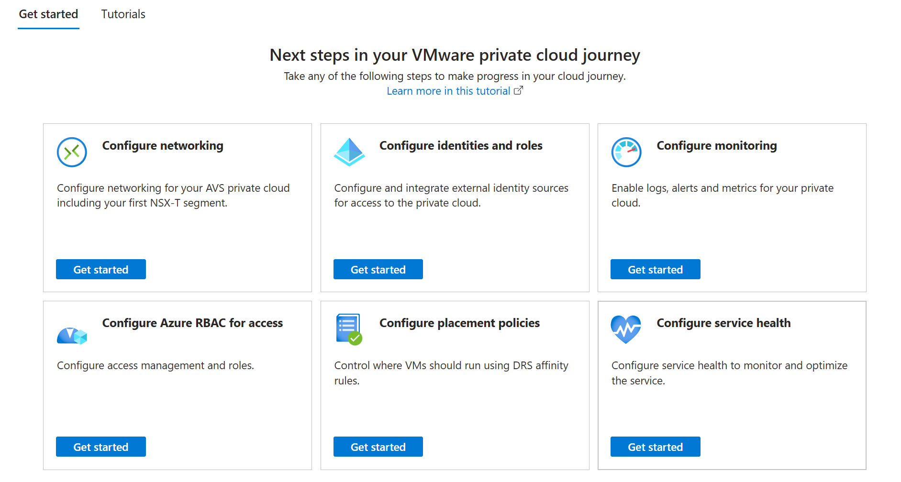
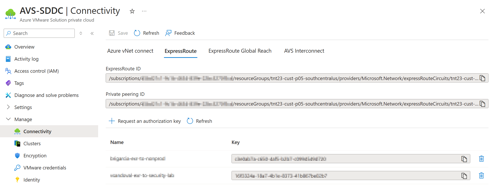
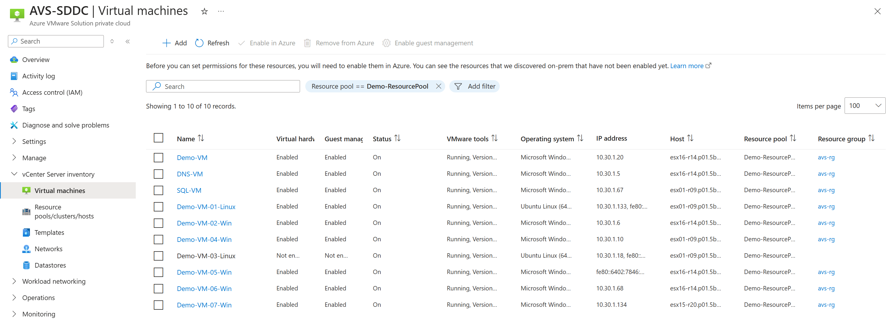

+++
author = "Husam Hilal"
title = "Azure VMware Solution for Azure Experts"
date = "2025-01-21"
description = "Explore Azure VMware Solution experience in Azure as an Azure Subject Matter Expert"
image = "images/avs-for-azure-expert.png"
aliases = [ "avs-azure-experience" ]
tags = [ "AVS", "VMware", "Azure", "Azure Champ", "Level 200" ]
keywords = [ "Azure VMware Solution", "Private cloud", "VMware", "Azure Portal" ]
series = [ "Azure VMware Solution" ]
categories = [ "Microsoft Azure" ]
toc = true
draft = false
+++

# Azure VMware Solution - The Azure Experience

Azure VMware Solution (AVS) bridges the gap between traditional VMware environments and modern Azure services, allowing customers to easily migrate, run, manage, and secure VMware workloads natively on Azure.

In the context of AVS, exploring Azure and VMware vSphere is like examining a coin—each side complements the other. **In this blog, I’ll focus on the Azure side of the coin, diving into how AVS integrates with Azure experience**. In a future blog, I’ll flip the coin to reveal the VMware side.


I am going to call Azure VMware Solution – "**AVS**" – for simplicity. However, it is not an official acronym


## AVS as an Azure Resource

AVS is represented as a **resource provider** within Azure **Microsoft.AVS**. You must [register this provider](https://learn.microsoft.com/azure/azure-vmware/deploy-azure-vmware-solution?tabs=azure-portal#register-the-microsoftavs-resource-provider) in your Azure subscription before provisioning AVS. This step parallels other Azure services, ensuring subscription readiness for specific services. If not registered, you cannot deploy AVS private cloud resources; users may see an error at deployment even if they have quota allocation. When an instance is deployed it is represented as `microsoft.avs/privateclouds`.

### Quota Requests

When you set up an Azure subscription, you begin with **zero quota**, unlike other Azure services where a default allocation may exists (e.g., compute cores for Virtual Machines). To deploy an AVS private cloud, customers must explicitly [request a minimum quota of **three hosts**](https://learn.microsoft.com/azure/azure-vmware/request-host-quota-azure-vmware-solution). This minimum is required to support **vSAN fault tolerance and data redundancy**, ensuring resilience during host failures. For example, a cluster with three nodes can handle one node's failure without data loss. It is important to mention here that customers can request additional quota to scale up their existing cluster or provision additional clusters.

## Exploring the Azure Portal for AVS

The [Azure Portal](https://learn.microsoft.com/azure/azure-portal/azure-portal-overview) provides an intuitive experience for managing AVS. Here’s a breakdown of key sections in the service (resource) menu :

### Overview

Under Overview you will find few key things you need to be aware of:

#### JSON View

Displays AVS resource properties in plain JSON format. You can select the latest API version and review key resource attributes. Most of these properties are available when browsing the service menu views in the AVS blade in Azure Portal. You may use the the JSON view to get certain information (e.g. find the IP address of vCenter).

#### Essentials

Essentials section provides some high-level information about the AVS private cloud  resource, including: *Resource Group*, *Status*, *Location* (Azure region), *Subscription*, *Tags*, *Management address block*, *Availability Zone* within the region.


**Network Address Blocks**:
AVS private cloud **management** components requires a minimum of a /22 network address block. Additionally, a /24 address block may be needed for **Multipath Input/Output** (MPIO) when adding external storage services that use iSCSI technology. A /23 address block might also be required for deploying additional clusters of the **AV64** SKU, an Azure fleet SKU.
The **key consideration** when selecting these network address blocks is ensuring they do not overlap with other networks, such as on-premises networks, Azure Virtual Networks (vNet), or Azure Virtual WAN (vWAN) hubs which may be connected to your AVS private cloud resource.


#### Get started and Tutorials

At the button of the page you will find two sections for **Get started** and **Tutorials** which provide helpful links to get you started learning about the service.

### Activity Logs

Activity Logs provide an audit trail of changes and operations on the AVS private cloud, ensuring traceability. This is similar to other Azure Resources.

### Access Control (IAM)

Similar to other Azure resources, AVS provides Access Control (IAM), where you can assign various levels of access, such as *Owner*, *Contributor*, *Reader*, or *custom roles*.


 It’s important to note that these permissions apply only to the Azure resource itself and are used to manage properties exposed through Azure APIs. They **do not affect** workloads within the VMware vSphere environment, such as VMs, network segments, or other vSphere resources. Permissions for those resources are managed separately through vCenter (vSphere Client) and NSX Manager.


### Diagnose and Solve Problems

This section offers troubleshooting tools and common problem resolutions. You can also see the most recent Azure health events if any. You can configure **service health alerts rules**, notifying relevant personnel of Azure health events related to AVS. This is similar to other Azure Resources.

### Locks

Similar to other Azure services, the **Lock** feature can be found under **Settings**. This feature helps prevent users from accidentally deleting or modifying resource properties by making them read-only.

- **Delete Lock**: Prevents deletion of AVS private cloud instance regardless of the user roles and RBAC permissions. 
- **Read-only Lock**: Prevents unintended changes to resource properties to avoid unplanned interruptions.


 Enabling locks is a best practice for production environments. Keep in mind that only the **Owner** or **User Access Administrator** built-in roles can create or delete management locks.


## Unique Features of AVS in Azure Portal

The AVS blade includes service-specific management sections:

### Manage

This section allows you to manage AVS private cloud specific configurations.

#### Connectivity

AVS offers multiple connectivity options to integrate with the Azure ecosystem and on-premises environments to enable hybrid cloud or full data center evacuation:  

- **Azure vNet Connect**:  This helps connecting the AVS private cloud to an Azure Virtual Network (vNet) through an internal ExpressRoute connection. This is just a shortcut method, see the next bullet for configuring the same connectivity manually. As a **cost advantage** there are no charges for the internal ExpressRoute connectivity.

- **ExpressRoute Authorization**: Provides the ability to request an **Authorization Key**, required to establish an ExpressRoute connection with the AVS-provided ExpressRoute circuit. This section also allows you to retrieve the **ExpressRoute Circuit ID** and **Private Peering ID** for configurating connectivity to Azure vNet or vWAN hub.  

  

- **ExpressRoute Global Reach**: This option is ideal for customers with existing ExpressRoute connectivity to Azure and do not have complicated network inspection requirements. Where it enables connectivity between the private peerings of two ExpressRoute circuits, such as:  
  - On-premises to Azure.  
  - AVS private cloud.

  This can also be helpful for connecting multiple AVS private cloud instances located in different regions. But be mindful that Global Reach is not available in all Azure regions.

#### Clusters

This sections enables you to manage AVS clusters:

- **Add** or **remove** hosts (nodes) in existing clusters (e.g. add AV64 clusters for capacity expansion.)
- **Deploy new** clusters (minimum of three hosts in each).
- **Delete** existing clusters if no longer used.

Here are couple considerations to keep in mind:

- Currently, AVS private cloud needs to have the first (aka seed or initial) cluster of AV36 or AV36P, and expand capacity by adding AV64 clusters (recommended). Leveraging AV64 is the only time you can mix SKUs in the same AVS private cloud deployment. For AV64, an additional management address block need to be configured under **Extended address block** accessible from the Clusters section.
- To add additional hosts, make sure you have enough quota. You may need to request additional quota when you expect to add capacity. Hosts will be added to an existing cluster in parallel, it takes about 30 minutes.

  

  

#### Encryption

That is where you can configure AVS private cloud to use a **customer managed key** (CMK) stored in Azure Key Vault for encrypting (wrapping) vSAN Key Encryption Key (KEK). It worth noting that for regulated industries you can use Azure Key Vault HSM protected keys or Azure Managed HSM which can provide FIPS 140-2 Level 2 or 3 protection.

#### VMware Credentials

That is were you can access the **CloudAdmin credentials** for vSphere client (**vCenter** Server) and **NSX** Manager. You can also rotate the passwords for those credentials. It worth mentioning that rotation can be automated. For example, you can use Azure Logic App to achieve that.

From this section you can also you can grab the **Web Client URI** for both of vCenter Server and NSX Manager, and since these URI are TLS (SSL) encrypted, you can check the Certificate thumbprint if needed.

#### Identity

That is where the user can enable **system-assigned managed identity** for the AVS private cloud. The main use case for this today is to grant AVS instance access to an Azure Key Vault when enabling Customer Managed Keys (CMK) for vSAN KEK encryption.

#### Storage

That is where you can attach additional datastores to the AVS private cloud instance. Today, through this section you can attach pre-provisioned **Azure NetApp Files** or **Azure Elastic SAN** volumes.

> The benefit of doing this is to allow expanding the AVS private cloud storage without adding additional hosts just for meeting storage requirements.

It worth noting that **Pure Storage** has an integration with AVS as a datastore as well that can be enabled separately.

#### **Placement Policies**  

That is where you can define VM placement policies, i.e. specifying where the VM need to be or not, such as:

- VM-Host Affinity/Anti-affinity
- VM-VM Affinity/Anti-affinity  

These policies can optimize licensing costs (e.g., SQL Server, Oracle).

#### Azure Hybrid Benefit

This is where you can create VM-Host affinity policy to take advantage of an already paid Software Assurance-enabled SQL server license applying it to AVS host/s.

#### Add-ons

That is were you can start configuring three main solutions for AVS including:

  

1. **VMware HCX** which is the primary solution used for migrating workloads to AVS. The license for HCX is include in AVS. [Access a **click-through demo** to experiment migrating VMs using VMware HCX to AVS](https://regale.cloud/Microsoft/play/3210/hcx-migration)
  

1. **VMware SRM** (which is being re-branded to **VMware Live Site Recovery**) which is an easy to enable disaster recovery solution for AVS. But you will need to purchase license from Broadcom. [Access a **click-through demo** to experiment protecting VMs with VMware SRM and AVS](https://regale.cloud/Microsoft/play/3245/vmware-site-recovery-manager-srm)

2. **Azure Arc** which is an Azure native service, when enabled for AVS it helps managing and operating VMs on vSphere making the experience very similar to native Azure VMs. It enables Create, Read, Update and Delete (CRUD) operations via the Azure APIs (including Azure Portal).

### vCenter Server Inventory  

This is only enabled if the AVS private cloud is **Arc-enabled**. Through this section, you can view existing VM deployed on AVS vSphere, you can also create or delete VMs. You can also **Arc-enable these VMs**, and take all advantages of Arc-enabled Servers including integration with Azure Monitor, Azure Update Manager, Windows Admin Center, Run Command, Defender for Cloud, etc. Also, you can view and **Azure-enable** *Resource Pools/clusters/hosts, Networks, Templates, and Datastores*. 

[Access a **click-through demo** to experiment the capabilities of Arc-enables AVS](https://regale.cloud/microsoft/play/4084/capabilities-of-arc-enabled-avs)

### Workload Networks

This is where you can manage some of the NSX configurations:

- **Segments**: These are the NSX segments. Generally speaking, if you are coming from an Azure networking background, these are very similar to Virtual Network subnet. You will be able to create new ones, update or delete existing ones.

  

- **DHCP**: You can configure NSX tier-1 gateway DHCP configurations from here. DHCP is an NSX managed feature. You can create a DHCP server or relay. You will need DHCP configurations when you create a segment, so you can assign IPs automatically to VMs in that segment.
- **DNS**: Similar to DHCP, its a managed feature in NSX. You will be able to create or configure DNS zones, and eventually configure the managed DNS service.
- **Internet connectivity**: This provides mutually exclusive options for Internet connectivity:
  - **Do not connect or connect using default route from Azure**: If not default route for quad-zero (i.e. 0.0.0.0/0) is advertised from an Azure vNet or Azure vWAN, then there will be no connectivity to Internet (as if Internet connectivity is disabled).
  - **Connect using SNAT**: This is the most simple way to configure outbound Internet connectivity through a managed SNAT service. You may use it in a testing environment, or ,less commonly, if you have no requirements for Internet traffic inspection.
  - **Connecting using Public IP down to NSX Edge**: With this option you can leverage provisioning a IP address block of Azure Public IP addresses assigned to NSX tier-1 gateway, where you can configure SNAT and DNAT for outbound and inbound Internet connectivity.

  

### Operations

That is where you can **verify if Azure Arc** is configured properly. You can also find **Run Commands**. Run Command is feature that you may see in other Azure resources such as VMs, it lets you perform operations that would normally require elevated privileges through a collection of PowerShell modules and cmdlets. These privileged operations are not part of what the default CloudAdmin role can perform. For example, you can configure Storage Policies, integration with External Identity Providers (LDAPS), Restart HCX Manager, Provision DR solutions like JetStream, Zerto, and other operations. Last part here is **Maintenance** section, which allows the you to configure service health alerts, find out any future upgrades or changes to the VMware components, and potentially reschedule a scheduled maintenance operation to avoid any interruptions.

### Monitoring and Diagnostics  

Similar to other Azure resources, you will notice the following sections:

- **Metrics**: Track and monitor things like CPU, memory, datastore, etc. utilization.
  
- **Alerts**: Configure Alert rules and Action groups based on certain Metrics, Logs, Resource Health, etc.
- **Diagnostic Settings**: Export syslog and metrics to destinations like Azure Log Analytics, Azure Storage, etc.
  
- **Advisor recommendations**: There is more to be added here, but currently the most popular recommendation you may get here is “New HCX version is available for upgrade”, as it is a best practice to keep HCX up to date (at both sites). Keep in mind that it is your responsibility to manage HCX upgrades.
  

## Help

Last but not least, under Help, you will find **Resource health** where you can monitor the health of the whole service. And most importantly, you will find **Support + Troubleshooting** this is the section where you can open support ticket if you are running into any issues with the service. Since AVS is a Microsoft first-party service, you contact Microsoft for any support related to AVS components.

## Final Thoughts

AVS combines the familiarity of VMware with the scalability of Azure, offering a seamless private cloud experience. While it integrates tightly with Azure’s ecosystem, its unique requirements, such as quotas, network planning, and specialized management options, make it crucial for administrators to understand the AVS lifecycle. Beside the Azure Portal experience, there are other ways to manage AVS including:

- [Azure CLI with `vmware` extension](https://learn.microsoft.com/cli/azure/vmware?view=azure-cli-latest)
- [PowerShell with `Az.VMware` module](https://learn.microsoft.com/powershell/module/az.vmware)
- [REST API for AVS](https://learn.microsoft.com/rest/api/avs/)

Next blog post will present the VMware experience of Azure VMware Solution. Stay tuned!

Join [AVSPros](https://aka.ms/AVSPros) if you're not a member yet!
