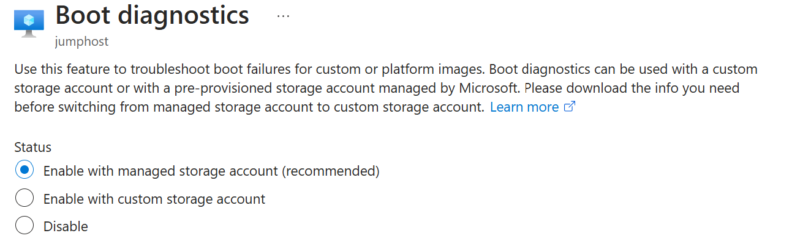

+++
author = "Husam Hilal"
title = "Enable Azure VM Boot Diagnostics leveraging Managed Storage Account using ARMClient Tool"
date = "2055-01-01"
description = "Learn how to automatically enable Azure VM Boot Diagnostics with Managed Storage Account using ARMClient Tool"
image = "images/boot-diag-managed-storage-arm-client.png"
aliases = ["azure-armclient-example"]
toc = false
tags = [
    "Storage Account",
    "Virtual Machine",
    "Azure Champ",
    "Azure"
]
series = ["Azure Core"]
categories = ["Microsoft Azure"]
draft = true
+++

## Background

The capability, of using Microsoft managed Storage Account when enabling Azure VM Boot Diagnostics, is an advantage to the customers. Where they eliminate one more Storage Account that they need to manage. That's awesome! Even the amount of data stored is very minimal; two files per VM. But, these files could become a burden especially if there are many VMs, of if the customer is using some ephermal VMs, as those files remain stale when a VM is deleted (they are not cleared automatically).



Leveraging a managed Storage Account for Boot Diagnostics data can be easily achieved when creating new VMs in Azure using an ARM template for example, because it can be declared in the template itself (just make sure the API version for the Microsoft.Compute/virtualMachines resource is "2020-06-01" or above), see below:

```json
                "diagnosticsProfile": {
                    "bootDiagnostics": {
                        "enabled": true
                    }
                }
```

Basically, it is similar to what used to be, but without defining `storageUri` property. That's actually the trick (beside the API version).

## Problem

Now, the problem is what if you already have VMs deployed in Azure. **How to switch them to use the managed Storage Account capability**?! The official documentation says it's only possible through the portal. "Boot diagnostics using a manage storage account can currently only be applied through the Azure portal." That is a solution, but it's not scalable! How can we enable it for a group of VMs in one hit?

Eventually, there will be support to do this through various mechanisms such as PowerShell and Azure CLI. But, what about now? Can we create a scalable solution? Well! What if we think out of the box! Can we replace the whole properties of bootDiagnostics section in ARM and remove storageUri property. The answer, yes we can! And that's what happens when you try to change the setting through the portal. Do you want to see that in action? Sure, click F12 and look at the request that's being sent to ARM REST API when you click the Save button.

To simulate the same process and make it scalable for more VMs, I used a tool called ARMClient (it's part of Kudu which is in the core of Azure App Service), I recommend that tool when making REST API calls to ARM because it simply makes authentication straight forward and managing access tokens something beyond your worries 😉

Let's take a look at the script (running from PowerShell environment):

# https://github.com/projectkudu/ARMClient
#Login to Azure
ARMClient.exe login

#Setting parameters
[string] $enableBootDiagnostics = $true
$subscription = '<Subscription ID'
$resourceGroup = '<Resource Group>'
$vmsInResourceGroupId = "/subscriptions/$subscription/resourceGroups/$resourceGroup/providers/Microsoft.Compute/virtualMachines"

#Retrieving VMs in the Resource Group
$response = ([string] (armclient GET "$($vmsInResourceGroupId)?api-version=2019-12-01")) | ConvertFrom-Json
#$response.value[3].properties.diagnosticsProfile.bootDiagnostics

#Looping through the VMs and setting diagnosticsProfile to use Microsoft Managed Storage Account by removing the storageUri property
$response.value  | % {
armclient PATCH "$($_.Id)?api-version=2020-06-01" "{properties:{diagnosticsProfile:{bootDiagnostics:{enabled:$($enableBootDiagnostics.ToLower())}}}}"
}

So far, it's not feasible to do it this through Azure Policy because the  bootDiagnostics aliases are not part of the modifiable set of aliases in the modify action type. However, when this becomes possible. I recommend going the Azure Policy method, as it's cleaner and way more scalable.

To sum up, the idea here was to show how we can make operations possible in Azure even if there is no way to do it in PowerShell, Azure CLI, ...etc, until it becomes possible. Thanks to the Azure Resource Manager API, which is the heart of Azure!